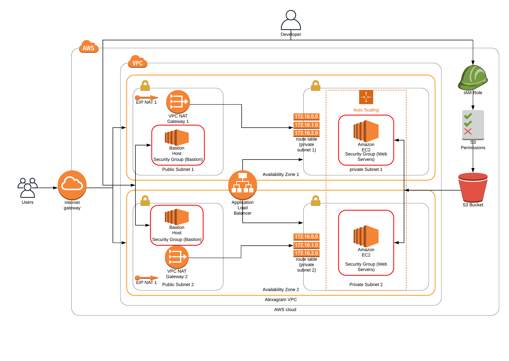
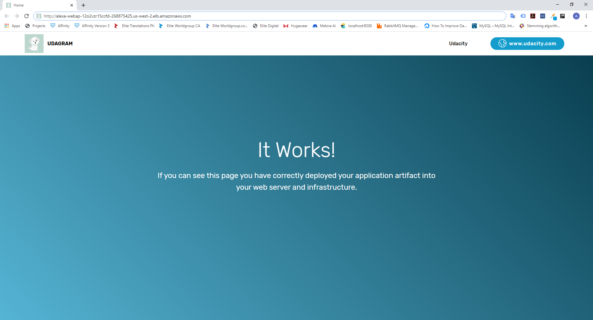
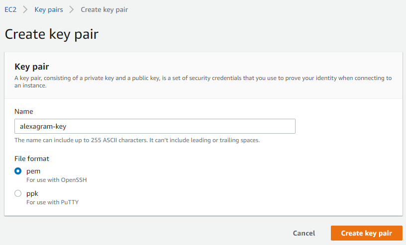

### Alexagram - Deploying a secure and scalable web application using AWS CloudFormation

### Infrastructure

### Files

1. alexagram-infra.yaml - the actual IaC that sets up the infrastructure for the web application mentioned above
2. alexagram-infra-params.json - the parameters needed to fulfill the setup of IaC above
3. alexagram-servers.yaml - the actual IaC that deploys servers with security and target groups on top of the infrastructure.
4. alexagram-servers-params.json - the parameters needed to fulfill the deployment of servers from IaC above 

### Actual Website

You can access the deployed website through [this](http://alexa-webap-12o2vzr15ccfd-268875425.us-west-2.elb.amazonaws.com/) link.

### Setup Instructions

1. First, you need to set up Keys under EC2 > Key Pairs > Create Key Pair like the one shown below. In my case, I used __alexagram-key__ but you can use any name that you want.
  

  a. If you use a different name like the one shown above, you must update the alexagram-infra-params.json with the name that you supplied in the form above.

2. Run the following commands:

  __./create.sh alexagram-servers alexagram-infra.yaml alexagram-infra-params.json__
  __./create.sh alexagram-servers alexagram-servers.yaml alexagram-servers-params.json__